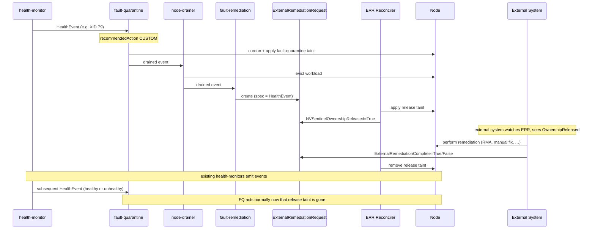

# ADR-041: API — External Remediation Request (ERR)

## Context

NVSentinel is the primary owner of nodes in the clusters where it operates: when a node joins, NVSentinel owns it, and any cordon/drain/reboot/terminate flows through NVSentinel's pipeline (health-monitor → fault-quarantine → node-drainer → fault-remediation).

For most failure modes, NVSentinel can remediate end-to-end with the existing maintenance CRs — `RebootNode`, `GPUReset`, `TerminateNode`. But there is a class of remediations NVSentinel cannot perform itself:

- CSP-side hardware repair (out-of-cluster work driven by a cloud provider's support workflow)
- RMA workflows (physical hardware swap performed by a vendor or operator)
- Long-running orchestrated workflows handled by external automation
- Manual operator intervention on physical infrastructure

In each case the remediation lives outside NVSentinel's control plane. Today, coordination between NVSentinel and the external party performing the work is ad-hoc — operators manually uncordon nodes, fight over taints, or use side-channel notifications. There is no in-band mechanism for NVSentinel to declare "I am releasing this node; another system is now responsible for it." Nor is there a way for that external system to declare back "I am done, the node is yours again."

A node must be owned by **exactly one** system at any point in time. Without a formal handoff, NVSentinel and an external system can both decide to act on the same node and race — duplicating remediation work, fighting over taints, or interleaving operations that corrupt cluster state.

The design must be agnostic to which external system is on the other side. NVSentinel cannot make assumptions about how, when, or whether an external system completes its work; the protocol must work for automated orchestrators, vendor support teams, and individual human operators alike.

## Decision

Introduce a new CRD, `ExternalRemediationRequest` (ERR), in the existing `nvsentinel.nvidia.com/v1alpha1` API group. ERR is the **exit door** from NVSentinel ownership:

- Created by `fault-remediation` when triage maps a fault to the `CUSTOM` recommended action (per [ADR-036](036-custom-remediation-actions.md)) with a `customRecommendedAction` configured to produce an ERR.
- The ERR's `spec` carries the triaged `HealthEvent` — the same `datamodels.HealthEvent` proto already emitted by every health-monitor and consumed by every downstream stage.
- The ERR reconciler applies a release taint to the target node and sets `NVSentinelOwnershipReleased=True`. From that moment, an external system is responsible for the node.
- The external system, observing the ERR, performs its remediation and writes `ExternalRemediationComplete=True` (success) or `False` (failure) back to the ERR's status.
- The ERR reconciler removes the release taint on either terminal value. Existing NVSentinel components (health-monitors, fault-quarantine) take over from there.

Coordination state lives in `status.conditions` only. The ERR object is the single coordination artifact between NVSentinel and the external party for the duration of the handoff.

## Implementation

### Module layout

The CRD type is defined in proto and generated via the existing `protoc-gen-crd` plugin (the same plugin that generates `HealthEventResource` today — see `data-models/protobufs/health_event.proto` line 121). The reconciler lives alongside the existing maintenance reconcilers in `janitor/`.

```text
data-models/
├── protobufs/
│   ├── health_event.proto                 (existing — already defines HealthEvent)
│   └── external_remediation.proto         (new — defines ExternalRemediationRequest,
│                                                 its status, and a Condition message)
└── pkg/protos/
    └── external_remediation.pb.go         (generated by protoc-gen-go)

distros/kubernetes/nvsentinel/charts/janitor/crds/
└── external_remediation_request.crd.yaml  (generated by protoc-gen-crd)

janitor/
├── api/v1alpha1/
│   ├── external_remediation_register.go   (new — thin scheme registration; no field
│   │                                              definitions, the proto-generated
│   │                                              types are used directly)
│   ├── gpureset_types.go                  (existing)
│   ├── rebootnode_types.go                (existing)
│   ├── terminatenode_types.go             (existing)
│   └── groupversion_info.go               (existing — already nvsentinel.nvidia.com/v1alpha1)
├── pkg/condition/
│   └── condition.go                       (new — adapter between proto Condition and
│                                                 metav1.Condition for controller-runtime
│                                                 helpers like SetCondition)
└── pkg/controller/
    └── externalremediationrequest_controller.go (new)
```

When a field is added to `HealthEvent` in `health_event.proto`, the ERR CRD schema updates automatically on the next `make generate`; no Go struct edits required. This is the same automation already used for `HealthEventResource`.

### API

Defined in `data-models/protobufs/external_remediation.proto`:

```protobuf
import "google/protobuf/timestamp.proto";
import "health_event.proto";
import "github.com/yandex/protoc-gen-crd/library/go/k8s/protoc_gen_crd/proto/crd.proto";

// Condition is the wire equivalent of metav1.Condition.
message Condition {
  string type = 1;
  string status = 2;          // "True", "False", "Unknown"
  int64 observed_generation = 3;
  google.protobuf.Timestamp last_transition_time = 4;
  string reason = 5;
  string message = 6;
}

message ExternalRemediationRequestStatus {
  repeated Condition conditions = 1;
}

message ExternalRemediationRequest {
  option (protoc_gen_crd.k8s_crd) = {
    api_group: "nvsentinel.nvidia.com",
    kind: "ExternalRemediationRequest",
    plural: "externalremediationrequests",
    singular: "externalremediationrequest",
    short_names: ["err"],
    categories: ["nvsentinel"]
  };
  HealthEvent spec = 1;                              // reused from health_event.proto
  ExternalRemediationRequestStatus status = 2;
}
```

The condition type names are defined as Go constants in `janitor/pkg/controller/`:

```go
const (
    ERROwnershipReleasedCondition   = "NVSentinelOwnershipReleased"
    ERRRemediationCompleteCondition = "ExternalRemediationComplete"
)
```

`HealthEvent` in the spec is the **same** `datamodels.HealthEvent` message used everywhere else in NVSentinel — `protoc-gen-crd` walks the reference and emits the full nested schema into the generated CRD. Adding a field to `HealthEvent` propagates here automatically without any code change in this module.

The proto-generated Go types are used directly by the controller; there is no hand-maintained mirror struct. A thin adapter in `janitor/pkg/condition` converts between proto `Condition` and `metav1.Condition` at the controller boundary so existing `meta.SetStatusCondition` / `meta.IsStatusConditionTrue` helpers continue to work.

Concrete shape from `kubectl get externalremediationrequest -o yaml`:

```yaml
apiVersion: nvsentinel.nvidia.com/v1alpha1
kind: ExternalRemediationRequest
metadata:
  creationTimestamp: "2026-05-11T21:16:02Z"
  generation: 1
  labels:
    nvsentinel.nvidia.com/component-class: gpu
    nvsentinel.nvidia.com/node: node-01.example-cluster.internal
    nvsentinel.nvidia.com/recommended-action: external-remediation
  name: gpu0-xid79-node-01
  namespace: nvsentinel
spec:
  agent: gpu-health-monitor
  checkName: nvml-xid-79
  componentClass: gpu
  customRecommendedAction: external-remediation
  entitiesImpacted:
    - {entityType: GPU,  entityValue: "0"}
    - {entityType: PCIE, entityValue: "0000:18:00.0"}
  errorCode: [XID-79]
  generatedTimestamp: "2026-05-11T20:14:07Z"
  id: he-7f0b3e2c-1cab-4d22-9a96-2d5b3a8ee2f1
  isFatal: true
  isHealthy: false
  message: GPU fell off the bus (XID 79) on /dev/nvidia0; node requires hardware-level repair.
  metadata:
    cluster: example-cluster-01
    cudaVersion: "12.4"
    driverVersion: 550.144.03
    serialNumber: "1320820063748"
  nodeName: node-01.example-cluster.internal
  processingStrategy: EXECUTE_REMEDIATION
  recommendedAction: CUSTOM
  version: 1
status:
  conditions:
    - type: NVSentinelOwnershipReleased
      status: "True"
      observedGeneration: 1
      lastTransitionTime: "2026-05-11T20:14:09Z"
      reason: ReleaseTaintApplied
      message: Applied taint nvsentinel.nvidia.com/external-remediation=gpu0-xid79-node-01:NoSchedule to node-01.example-cluster.internal; node released to external system.
    - type: ExternalRemediationComplete
      status: "Unknown"
      observedGeneration: 1
      lastTransitionTime: "2026-05-11T20:14:09Z"
      reason: AwaitingExternalSystem
      message: Waiting for external system to set ExternalRemediationComplete=True (success) or False (failure).
```

### Condition state machine

`True` and `False` are **terminal** states for both conditions. Conditions in flight are represented by `Unknown`; once a condition lands on `True` (the named state has been achieved) or `False` (it cannot be achieved), it does not transition again for the same generation. This matches the convention already established by `RebootNode`, `GPUReset`, and `TerminateNode`.

The reconciler calls `SetInitialConditions` on first reconcile, writing every condition as `Unknown` with `reason: Initializing` (modelled after `janitor/api/v1alpha1/rebootnode_types.go`).

| Condition | Initial | Terminal `True` | Terminal `False` | Set by |
| --- | --- | --- | --- | --- |
| `NVSentinelOwnershipReleased` | `Unknown` (`Initializing`) | Release taint applied to `spec.nodeName` | Persistent failure to apply taint (e.g. unrecoverable API-server error such as a missing RBAC grant) | ERR reconciler |
| `ExternalRemediationComplete` | `Unknown` (`AwaitingExternalSystem`) | External system reports remediation succeeded | External system reports remediation failed (e.g. RMA declined, repair unsuccessful, external system gave up) | **External system** |

Both `True` and `False` on `ExternalRemediationComplete` are meaningful, terminal outcomes from the external system's perspective. The ERR reconciler treats them symmetrically: remove the release taint, log the outcome, and leave the rest of the system to handle whatever follows. Specifically:

- On `True`: the external system has reported success. NVSentinel's health-monitors will, on their next observation, naturally either emit a healthy event (clearing fault-quarantine state and returning the node to service) or re-detect the same fault (re-triggering the pipeline and producing a fresh ERR).
- On `False`: the external system has reported "I tried, couldn't fix it." The same downstream path applies — health-monitors decide. If the underlying fault is still present, a new ERR will be produced via the standard pipeline. If the fault is gone (the external system gave up but the issue resolved separately), the node returns to service naturally.

This is symmetric to how the existing `RebootNode` / `GPUReset` CRs interact with the rest of the system: a failed remediation is followed either by re-detection (if the fault persists) or by silent recovery (if it doesn't). No special action is needed from the ERR reconciler beyond removing the taint.

All conditions are append-or-update in place via the `SetCondition` helper, which short-circuits no-op updates so reconcile storms don't flap `lastTransitionTime`.

### ERR reconciler

**Watches:** `ExternalRemediationRequest` (primary); `Node` (secondary, to detect taint drift).

**Reconcile loop:**

1. On first reconcile, call `SetInitialConditions`: write `NVSentinelOwnershipReleased=Unknown (Initializing)` and `ExternalRemediationComplete=Unknown (AwaitingExternalSystem)`.
2. If `NVSentinelOwnershipReleased` is `Unknown`:
   - Apply the configured release taint to `spec.nodeName` (idempotent).
   - On success: set `NVSentinelOwnershipReleased=True` with `reason=ReleaseTaintApplied`.
   - On persistent failure: set `NVSentinelOwnershipReleased=False` with `reason=ReleaseTaintFailed`. The ERR is now in a terminal failed state; no further reconciliation work, but the object remains so the failure is visible to operators. Transient errors continue to retry via the standard controller-runtime backoff.
3. If `ExternalRemediationComplete` has resolved to `True` or `False` (either terminal):
   - Remove the release taint from `spec.nodeName` (idempotent; tolerate missing taint). Verify both key AND value match this ERR's name before removing — protects against drift from a previous, no-longer-existing ERR.
   - Done; no further work.
4. Otherwise (`ExternalRemediationComplete` is still `Unknown`): no-op until the external system writes a terminal value.

**Release taint** (key configurable via Helm values):

```text
nvsentinel.nvidia.com/external-remediation=<err-name>:NoSchedule
```

The taint **value** is the `metadata.name` of the owning `ExternalRemediationRequest` — the same deterministic hash used by `fault-remediation` when constructing the ERR. This is the only piece of node-side metadata the design adds; no Node labels or annotations are created. The taint carries both the operational guard ("don't act on this node") and the correlation key ("which ERR owns the release") in one place.

The taint is the *single source of truth* for "this node is not owned by NVSentinel right now." Any other NVSentinel component that mutates the target node's quarantine, drain, or remediation state — applying or removing taints, cordoning or uncordoning, creating or completing maintenance CRs, modifying NVSentinel-managed annotations — MUST refuse to take that action on a node carrying any taint with key `nvsentinel.nvidia.com/external-remediation`, regardless of value. `node-drainer` and `fault-quarantine` get a small guard; `fault-remediation` inherits the same guard through its existing node-selection logic. Health events for such nodes continue to be observed, recorded, and exported as usual; the guard applies only to state-changing actions.

**Single active ERR per node.** Because the `(key, effect)` taint tuple is unique on a Node, only one ERR can have its release taint applied at a time. This invariant is enforced by `fault-remediation`'s existing equivalence-group machinery (see the *`fault-remediation` integration* section): ERRs declare their own equivalence group and a status checker, and the existing "skip CR creation when a CR for a matching group is in progress" logic prevents a second concurrent ERR from ever being created. No new dedup code is required in the ERR reconciler.

**Idempotency:** taint application uses a server-side patch. The ERR reconciler verifies both key AND value match its own ERR name before treating the taint as "its own" — protecting against drift from a previous, no-longer-existing ERR.

**Node deletion:** if `spec.nodeName` no longer exists at reconcile time, the reconciler logs and treats the taint operation as complete. The ERR object remains until the external system writes a terminal value to `ExternalRemediationComplete`; if the external system never acknowledges, the ERR persists with `ExternalRemediationComplete=Unknown` (visible via the open-ERR gauge — see Observability).

### Discovery from the Node side

An operator who notices a tainted node finds the originating ERR by reading the taint value. With no Node labels or annotations, all discovery flows through the taint:

```bash
# 1. See the ERR name embedded in the taint value
kubectl describe node <node-name>
# Taints: nvsentinel.nvidia.com/external-remediation=gpu0-xid79-node-01:NoSchedule

# Or extract just that value:
kubectl get node <node-name> -o jsonpath=\
  '{.spec.taints[?(@.key=="nvsentinel.nvidia.com/external-remediation")].value}'

# 2. Fetch the ERR (default namespace: nvsentinel; if customised, search with -A)
kubectl get externalremediationrequest -A | grep <err-name>
kubectl get externalremediationrequest -n nvsentinel <err-name> -o yaml
```

To enumerate every node currently under external remediation:

```bash
kubectl get nodes -o json | jq -r '
  .items[]
  | select(.spec.taints[]?.key == "nvsentinel.nvidia.com/external-remediation")
  | [.metadata.name,
     (.spec.taints[] | select(.key=="nvsentinel.nvidia.com/external-remediation") | .value)]
  | @tsv'
```

The trade-off vs. duplicating the ERR name to a Node label is explicit: filtering nodes via `kubectl get nodes -l …` is unavailable; operators use the jq query above. Given how rarely this enumeration is needed in practice, the cost of maintaining a parallel Node label was judged not worth it.

### `fault-remediation` integration

`fault-remediation` already uses `GetEffectiveActionName(he)` (per ADR-036) to resolve the action name for routing. To produce ERRs:

- **TOML config** — declare the external-remediation action's `MaintenanceResource` with `apiGroup: "nvsentinel.nvidia.com"` and `kind: "ExternalRemediationRequest"`. No schema extension is needed; this reuses the same `apiGroup` + `kind` knobs that already route the reboot action to `janitor.dgxc.nvidia.com` / `RebootNode`.
- **`fault-remediation/pkg/remediation/remediation.go`** — `CreateMaintenanceResource` already builds the maintenance CR from `apiGroup` + `kind` via the dynamic client. The branch for `ExternalRemediationRequest` mostly falls out of the existing template-render path; only the ERR-specific fields (labels) need explicit handling.

ERR construction details:

- `metadata.name` is a deterministic hash of `(nodeName, healthEvent.id)` so repeated reconciles of the same event do not create duplicate ERRs. The name **also** becomes the value of the release taint applied by the ERR reconciler — so it MUST be a valid Kubernetes taint value (≤ 63 chars, alphanum + `.`, `-`, `_`).
- `metadata.namespace` is the configured ERR namespace (default: `nvsentinel`).
- `metadata.labels` include `nvsentinel.nvidia.com/node`, `…/component-class`, and `…/recommended-action` for observability inside the ERR API (these do NOT propagate to the Node — see "Discovery from the Node side" for the rationale).
- `spec` (the inlined HealthEvent) is a full copy of the triaged event.

**Equivalence-group integration.** ERR creation goes through the same `latestFaultRemediationState`-annotation + `ShouldSkipCRCreation` machinery as existing maintenance CRs (`RebootNode`, `GPUReset`, etc.) — see `fault-remediation/pkg/reconciler/reconciler.go` `shouldCreateCRForGroup`. Two pieces are added:

1. **Equivalence group declared in the TOML config** for the external-remediation action, e.g. `equivalenceGroup: "external-remediation"`. Cross-kind supersedence (e.g. `external-remediation` superseded by `restart`, or vice versa) can be declared the same way as today, so a node with an in-flight `RebootNode` does not get a concurrent ERR, and a node with an in-flight ERR does not get a concurrent maintenance CR. The `external-remediation` action MUST NOT declare an `impactedEntityScope`; the release taint is node-scoped, so only one ERR can hold ownership of a node at a time. Per-component differentiation via `impactedEntityScope` (the way `GPUReset` does it) would produce multiple concurrent ERRs whose taints would collide. If multiple components on a node need external remediation, they are all carried by the first ERR's `HealthEvent`; subsequent events are skipped at `fault-remediation` and will be re-detected by health monitors after the first ERR completes if the underlying faults remain.
2. **A status checker for `ExternalRemediationRequest`** plugging into the existing `StatusChecker` interface: returns `ShouldSkip=true` when the ERR's `ExternalRemediationComplete` condition is `Unknown` (in-flight); `false` once it is terminal (`True` or `False`), at which point the entry is pruned from the annotation as usual.

This gets the "single active ERR per node" invariant for free — it falls out of the existing skip logic, no bespoke deduplication code in the ERR reconciler.

`fault-remediation` does **not** create both an ERR and a maintenance CR for the same event — the equivalence group declares one or the other.

### Sequence diagram



### RBAC

**ERR reconciler ServiceAccount:**

- `externalremediationrequests` — get, list, watch, update (status only)
- `nodes` — get, list, watch, patch (for taint apply/remove)
- `events` — create

**External system ServiceAccount:**

- `externalremediationrequests` — get, list, watch, patch (status only)

External systems must NOT be granted write access to `nodes` through the external-remediation flow — node operations are mediated by the ERR reconciler via the release taint. External systems may carry separate node-level access if they choose to create in-cluster remediation CRs (e.g. `GPUReset`) as part of their workflow, but that is a separate authorisation surface.

### Observability

**Metrics** (Prometheus, namespace `nvsentinel_external_remediation`):

| Metric | Type | Labels | Meaning |
| --- | --- | --- | --- |
| `err_total` | Counter | `phase` (`created`, `released`, `completed`); `result` (`success`, `failure`; empty when `phase=created`) | ERRs entered each phase. `released` with `result=failure` indicates a persistent taint-apply failure (`NVSentinelOwnershipReleased=False`); `completed` with `result=failure` indicates the external system reported `ExternalRemediationComplete=False`. |
| `err_open` | Gauge | `node`, `recommended_action` | Open ERRs — `ExternalRemediationComplete=Unknown`, neither succeeded nor failed yet. Operators alert on persistence (an ERR open longer than the expected external-remediation SLO) and on aggregate counts (>N nodes simultaneously released to external systems may itself warrant attention). |
| `err_age_seconds` | Histogram | `recommended_action`, `result` (`success`, `failure`) | Time from ERR creation to terminal `ExternalRemediationComplete`. Tracked separately for success and failure resolutions so operators can see SLO distributions for each outcome. |
| `unknown_remediation_action_total` | Counter | `action` | Health events carrying a `customRecommendedAction` not registered in fault-remediation's config — exposes the "bad action name, no ERR ever produced" case. Emitted by `fault-remediation` itself (the only component with the config) every time `equivalence_groups.go` `GetGroupConfigForEvent` returns its existing "Action not found in remediation configuration" warning. |

In addition to the metrics above, the ERR reconciler exposes `controller_runtime_reconcile_errors_total{controller}` and `controller_runtime_reconcile_total{controller, result}` for free via the controller-runtime library — operators get reconcile-loop error rates and per-controller throughput without further plumbing. The standard kubebuilder dashboards work as-is.

**Events** (Kubernetes events on the ERR object):

- `ReleaseTaintApplied`, `ReleaseTaintFailed`, `ReleaseTaintRemoved`

**Tracing:** the ERR reconciler propagates the OTEL span ID from the triaged HealthEvent's `metadata.spanIds` through its reconcile loop, so the full lifecycle from health-monitor emission to ERR completion is observable end-to-end alongside health-monitor-originated events.

## Rationale

- **Single coordination surface for external remediation.** One CRD, one reconciler, one integration point in `fault-remediation`. Any external system — automated orchestrator, vendor support team, individual operator — speaks the same protocol. No bespoke per-system entry/exit.
- **CRDs are debuggable.** Operators can `kubectl get err -A` to see every node currently outside NVSentinel ownership and the reason. Status conditions surface the exact step the handoff is on.
- **Plugs into ADR-036.** The `CUSTOM` recommended action and `GetEffectiveActionName` resolution already exist; this ADR layers the ERR-producing branch on top of that machinery rather than introducing a parallel routing path.
- **Asynchronous by design.** Remediation can take hours to weeks (RMA, replacement parts, scheduled CSP windows). The protocol does not require either side to be online for the other to progress.
- **Reuses the existing pipeline.** The ERR is produced as the terminal artifact of the standard quarantine → drain → fault-remediation path, with no special routing.

## Consequences

### Positive

- Clear, enforceable ownership invariant: **a node is owned by NVSentinel iff it does not carry the release taint.**
- One protocol for all external integrations, present and future.
- Standard Kubernetes patterns throughout (CRDs, conditions, RBAC) — no custom RPCs, no shared databases.

### Negative

- One new CRD and one new reconciler to operate and monitor.
- Asynchronous handshake adds latency vs. direct RPC (typically seconds, but bounded by controller-runtime reconcile backoff).
- External systems must be granted CRD access in the cluster — this is a new authorisation surface for cluster admins to reason about.
- The release-taint guard requirement adds a small new code path to `fault-quarantine` and `node-drainer`. Mechanically simple, but a touchpoint that needs coordination with those component owners.

### Mitigations

- The asynchronous latency is dominated by quarantine + drain (already in the pipeline), so the additional ERR reconciliation contributes a small fraction of total handoff time.
- RBAC is intentionally minimal: external systems get status-only patch access to ERRs (the system's response to NVSentinel's release). No node-level access is granted via this flow.
- Observability (metrics, events, tracing) gives operators the same level of insight as the existing NVSentinel pipeline.
- The release-taint guard is a single shared helper (proposed `commons/pkg/externalremediation.IsNodeReleasedToExternal(node)`) called from a small number of action sites in `fault-quarantine` and `node-drainer`. No new infrastructure.

## Alternatives Considered

### Direct gRPC API between an external system and NVSentinel

**Rejected** because: bespoke per-external-system surface; not debuggable with `kubectl`; doesn't extend to individual operators without building a CLI; would require parallel infrastructure (TLS, service accounts, load balancing) that the CRD path inherits from Kubernetes for free.

### Reuse existing maintenance CRs (RebootNode, TerminateNode, GPUReset)

**Rejected** because: those CRs encode specific in-cluster actions performed by the janitor, not generic ownership transfer. An external system performing an RMA isn't doing "reboot" or "terminate" — it's doing arbitrary work that NVSentinel doesn't model. Forcing this through existing CRs would muddy their semantics. External systems remain free to create those CRs directly when in-cluster remediation is part of their workflow.

### Just use a taint, no CRD

**Rejected** because: a taint by itself has no acknowledgment signal. The external system has no way to communicate "I'm done" back to NVSentinel except by removing the taint (which it shouldn't be authorised to do directly on the node API), or via metadata on the node object (which has the same authorisation problem). The CRD gives a purpose-built object for the external system to write to.

### Hand-mirror HealthEvent fields in Go with kubebuilder markers (instead of proto-driven CRD)

**Rejected** because: the mirror struct would have to be hand-updated every time the HealthEvent proto changes, defeating the goal of having the spec auto-track the upstream schema. The proto-driven path via `protoc-gen-crd` reuses the existing automation that already powers `HealthEventResource`.

### Use `runtime.RawExtension` for the spec (kubebuilder + schemaless)

**Rejected** because: loses CRD-level field validation at the API-server admission boundary. `kubectl explain externalremediationrequest.spec` would return nothing useful, and structurally malformed specs would only be caught at controller runtime via `protojson.Unmarshal` rather than at the admission gate. The proto-driven path gives both auto-tracking and full schema validation.

## Notes

### Ownership definition

A node is **owned by NVSentinel** if and only if it does *not* carry any taint with key `nvsentinel.nvidia.com/external-remediation` and effect `NoSchedule`. The taint's *value* identifies the owning `ExternalRemediationRequest` and is used for operator-side discovery; the ownership invariant itself is keyed on the taint's existence, regardless of value. NVSentinel components MUST refuse to take destructive action on a tainted node.

### Failure modes

- **External system never sets `ExternalRemediationComplete`.** No timeout. NVSentinel makes no assumptions about how, when, or whether an external system completes its work. The ERR persists with `ExternalRemediationComplete=Unknown`, the node stays tainted, `err_open` shows the ERR as in-flight for the affected node, and operators are notified via alerts on `err_open` persistence (e.g. an ERR open longer than the expected external-remediation SLO).
- **External system sets `ExternalRemediationComplete=False`.** A legitimate terminal outcome meaning "I tried, couldn't fix it." Release taint removed; existing health-monitors are still observing the node, so a persistent fault re-triggers the pipeline and produces a fresh ERR. Self-healing without operator action — same behaviour pattern as a failed `RebootNode` CR.
- **Node deleted while ERR is open.** ERR reconciler logs and treats taint operations as no-ops. The ERR object remains so the external system can still acknowledge completion (which is then a no-op against the missing node). The ERR is GC'd by the standalone-ERR TTL policy (deferred to a follow-up ADR — see Non-goals).
- **Multiple distinct faults on a node arriving while an ERR is in flight.** All subsequent health events from `health-monitor` resolve to the same `external-remediation` equivalence group as the in-flight ERR and are skipped by `fault-remediation`. Only the first event's `HealthEvent` is captured in the ERR spec. After the ERR completes and the release taint is removed, persistent faults are re-detected by health monitors on the next observation and produce a fresh ERR.
- **Health event (healthy or unhealthy) arrives at fault-quarantine while an ERR is in flight.** Fault-quarantine's release-taint guard refuses to act on the release-tainted node, regardless of event polarity. The event is stored as a historical record but causes no state change. The ERR remains the only authority for transitioning the node out of "released" state. After the release taint is removed, the next health-monitor observation drives fault-quarantine's state transition normally.

### Non-goals

- **Mechanisms for external systems to inject faults into NVSentinel.** This ADR covers only the exit door — fault-remediation produces an ERR in response to a CUSTOM-action health event sourced from existing health-monitors. A separate future ADR will introduce a complementary entry-door CRD that lets external systems declare faults directly to NVSentinel; that CRD's reconciler will produce the same CUSTOM-action health event that this ERR design already responds to, so no changes here are required to support it.
- **External-system implementation.** External systems patch ERR conditions; their internal logic is out of scope for this ADR.
- **New remediation actions.** This ADR uses the existing `CUSTOM` action from ADR-036; it does not extend the action set.
- **In-cluster remediation CRs.** External systems that need to trigger in-cluster operations (`GPUReset`, `RebootNode`, `TerminateNode`) create those CRs directly as part of their remediation. This ADR does not change those flows.
- **Standalone-ERR garbage collection.** ERRs are not auto-collected by this design; a follow-up ADR will cover TTL/GC policy if it becomes necessary in operation.

### Migration

No migration required — this is a pure addition. Existing `MaintenanceResource` entries continue to route to whatever `apiGroup`+`kind` they already declare; only TOML entries explicitly pointing at `nvsentinel.nvidia.com / ExternalRemediationRequest` produce ERRs.

## References

- Tracking issue: [#1276](https://github.com/NVIDIA/NVSentinel/issues/1276) — the capability gap this ADR addresses.
- [ADR-036: Custom Remediation Actions](036-custom-remediation-actions.md) — the `CUSTOM` recommendedAction this ADR builds on.
- [HealthEvent proto](../../data-models/protobufs/health_event.proto) — the source-of-truth schema for the CRD spec.
- [RebootNode CRD](../../janitor/api/v1alpha1/rebootnode_types.go) — pattern reference for condition-driven CRDs in this repo.
